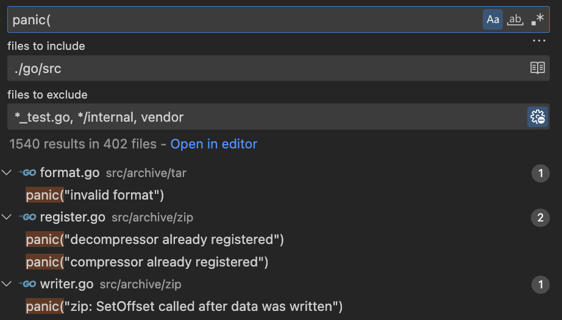
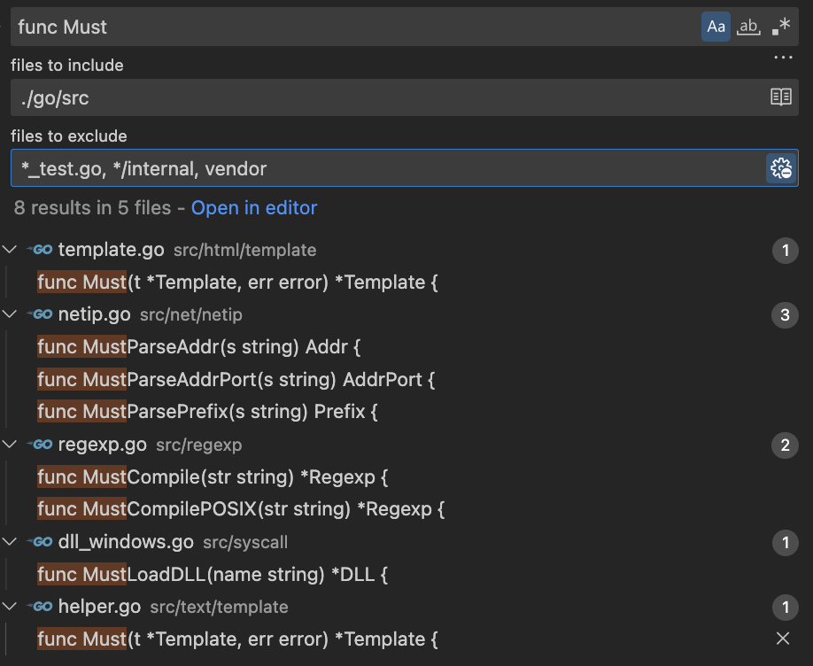
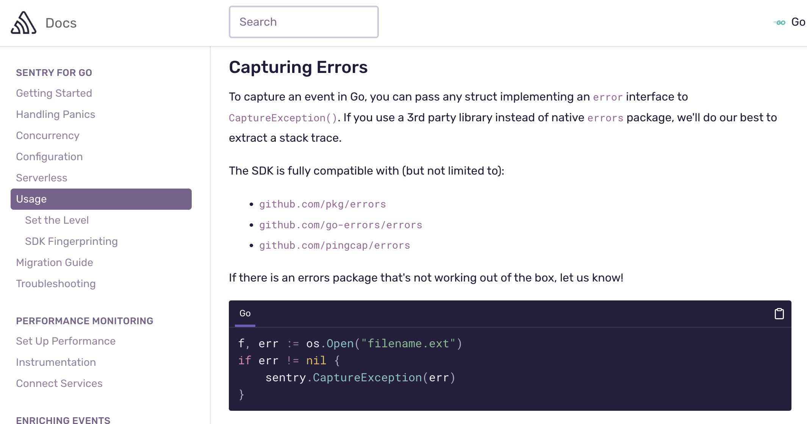

<!--
_footer: 'mutaguchi'
-->
# go ctx & err


---
## アジェンダ

- テーマ選定理由
- Context
- Error


---
## テーマの選定理由

- 浅いところの知識 ( k8s など ) を共有してもその場限りになる
- 使う箇所でないと聴いても忘れる
- 自分と聴講者両者にとってのためになるテーマにしたい
- 何となく使っている箇所の基礎を固めるという内容なら上記を満たせるのでは？
	- Context
	- Error


---
## Context

> タスク（プロセスまたはスレッドも含む）によって使用されるデータの最小セットである。

cf. [コンテキスト（情報工学）](https://ja.wikipedia.org/wiki/%E3%82%B3%E3%83%B3%E3%83%86%E3%82%AD%E3%82%B9%E3%83%88_(%E6%83%85%E5%A0%B1%E5%B7%A5%E5%AD%A6))

タスク ( = リクエスト ) を実行する上で使用されるデータの最小セットということでこの用語が採用されているものの、コンテキストスイッチといったスレッド周りで用いられるコンテキストとは概念が少し異なる


---
## Go の並行処理パターン - Context
 
- Go 製サーバーは各リクエストを独自ゴルーチンで処理する
- 一連のゴルーチンはリクエスト範囲内の値にアクセスする必要ある
	- エンドユーザ ID／承認トークン／リクエスト期限など
- リクエストがキャンセルされた場合、動作しているすべてのゴルーチンはすぐに終了し、システムが使用中のリソースを再利用できるようにする必要がある

これらの解決手段として context パッケージが用意されている

cf. [Go Concurrency Patterns: Context](https://go.dev/blog/context)


---
## 責務 - Context

- キャンセルの伝達
- リクエスト範囲内の値の伝達

cf. [Standard library > context - Overview](https://pkg.go.dev/context#pkg-overview)


---
## 責務 ( 補足 ) - Context

デッドラインもタイムアウトもキャンセルをラップした処理なので、本スライドでは一括してキャンセル処理として扱う

```go
func WithDeadline(parent Context, d time.Time) (Context, CancelFunc) {
	( ... 略 ... )
	if cur, ok := parent.Deadline(); ok && cur.Before(d) {
		// The current deadline is already sooner than the new one.
		return WithCancel(parent)
	}
	( ... 略 ... )
}
func WithTimeout(parent Context, timeout time.Duration) (Context, CancelFunc) {
	return WithDeadline(parent, time.Now().Add(timeout))
}
```

---
## 使い方 - Context

リクエストが発生する箇所では Go の慣習的に第一引数として渡す

```go
ctx := context.Background()
client, err := spanner.NewClient(ctx, "projects/foo/instances/bar/databases/zoo")
```

リクエスト ( ネットワーク I/O ) が発生するところにおいて並行処理の制御を目的として用いる

※ もし異なるケースがあったら教えて下さい


---
## 責務ではない事 - Context

- 関数のオプショナル引数 ( ≒ python のキーワード引数 ) ではない
- WithValue をオプショナル引数用途で使うと関数の実行に必要なシグネチャ ( 引数と返り値 ) が理解できないものになる

NG )
```golang
var name string
func rename(ctx context.Context) {
	name = ctx.Value("name")
}
```

cf. [Standard library > context - Overview](https://pkg.go.dev/context#pkg-overview)


---
## 責務ではない事 - Context

オプショナル引数が必要なら標準パッケージでも使われている Functional Option Pattern ( FOP ) パターンの採用を検討する

```go
options := []option.ClientOption{
	option.WithCredentialsFile("PATH_TO_CREDENTIALS_FILE"),
}
client, err := spanner.NewClient(ctx, dbName, options...)
```

FOP も乱用するとシグネチャが分からなくなるので、必須パラメータ ( 上記コードでいう dbName ) を渡す用途では使わない


---
## データ構造 - Context

```go
type valueCtx struct {
	Context
}
```

- 親の参照を持つ隣接リストで実装されている
- 値の参照は、子から親のコンテキストを参照可能
- キャンセル処理の伝達は、親から子へのみ行われる
	- 親がキャンセルされた → 子もキャンセルされる
	- 子がキャンセルされた → 親はキャンセルされない

cf. [Goのcontext.Contextで学ぶ有向グラフと実装](https://future-architect.github.io/articles/20210629a/)


---
## インターフェース - Context

```go
type Context interface {
	// Done は、この Context がキャンセルされるか、タイムアウトしたときに閉じられるチャネルを返す
	Done() <-chan struct{}
	// Err は、Done チャンネルが閉じた後、このコンテキストがキャンセルされた理由を示す
	Err() error
	// Deadline は、この Context がキャンセルされる時刻（がもしあれば）を返す
	Deadline() (deadline time.Time, ok bool)
	// Value は、key に関連する値を返し、無い場合は nil を返す
	Value(key interface{}) interface{}
}
```

キャンセルされるとチャンネルを使った伝達が行われる


---
## 動作確認 - Context

- ケース 1. 直列の場合

```
% go run cmd/ctx_cancel_1/main.go
canceled -> 3
canceled -> 2
```

- ケース 2. 木構造の場合

```
% go run cmd/ctx_cancel_2/main.go
canceled -> 1-2
canceled -> 1-1
```


---
## チャンネル - Context

なぜ Go では並列処理の信号伝達にチャンネルを使うのか？

紐解こうとすると `C10K問題` という 10 数年前のインターネットサービス黎明期に Apache サーバーが抱えていた問題が参考になる ( 今は対策されています )


---
## C10K問題 - Context

- クライアントが 10,000 台を超えた辺りからプロセス数の上限にあたるようになった
  - Apache は 1 リクエスト 1 プロセス処理していた
	- OS のプロセス数上限によってリクエストが捌けなくなる
		- 当時の 32bit Linux では 32,767 が上限


---
## C10K問題 - Context

- コンテキストスイッチのコストが増大
	- 複数のプロセスが 1 つの CPU を共有できるように、コンテキストを保存したり復元したりする過程のこと
	- Apache 方式ではリクエスト増＝プロセス増であるため、コンテキストスイッチのコストが無視できなくなる


---
## 並行プログラミング - Context

C10K問題に代表される有限なプロセス・スレッドの活用問題に対し、モダンなプログラミング言語ではスレッドを効率的に利用する機構が用意されている

Go は開発者である Rob Pike 氏が Communicating Sequential Processes ( CSP ) モデルが基になっていると述べており、ゴルーチンとチャンネルによって実現されている

cf. [Origins of Go Concurrency style by Rob Pike](https://youtu.be/3DtUzH3zoFo?t=130)


---
## channel or async/await - Context

並行プログラミングの処理系としては様々な言語で async/await が採用されているが、Go の開発者たちはデメリットも多いと考え CSP に基づく方法を採用した

cf. [Goはなぜasync/awaitを採用しなかったの？](https://zenn.dev/nobonobo/articles/9a9f12b27bfde9#go%E3%81%AF%E3%81%AA%E3%81%9Casync%2Fawait%E3%82%92%E6%8E%A1%E7%94%A8%E3%81%97%E3%81%AA%E3%81%8B%E3%81%A3%E3%81%9F%E3%81%AE%EF%BC%9F)

( 公式な情報元へは辿り着けなかったので各自でご判断ください )


---
## まとめ - Context

- キャンセルの伝達
  - 並行処理を行う上でスレッドを有効活用し、かつ、シンプルに表現できる CSP スタイルが基となり、ゴルーチン＆チャンネルによって実現されている
- リクエスト範囲内の値の伝達
	- グローバルな値 ( DB コネクションなど ) の受け渡しには使わない

#### 責務を理解して適切に取り扱おう


---
# Error

Go の開発者である Rob Pike 氏が 2015 年に行った講演資料に

> Go is simple, at least compared to established languages.
> Simplicity has many facets.
> Simplicity is complicated.

cf. https://go.dev/talks/2015/simplicity-is-complicated.slide#4

という一節がある


---
# Error

- シンプル ≠ 簡単
- シンプル = 複雑

プログラムをシンプルにするのは複雑で難しいが、シンプルであれば理解者が増える、理解者が増えると様々な面でメリットがある

Go を書く時は常にシンプルである事を意識しなさいという開発者からのメッセージ


---
# Error

エラーハンドリングは try catch などの例外処理は無く、早期リターンスタイル

```go
i, err := strconv.Atoi("42")
if err != nil {
    fmt.Printf("couldn't convert number: %v\n", err)
    return
}
fmt.Println("Converted integer:", i)
```

cf. [A Tour of Go](https://go-tour-jp.appspot.com/methods/19)


---
# Error

このようにエラーを無視する事は出来るが、よほどの理由がない限りはやっては駄目

```go
i, _ := strconv.Atoi("42")
```

エラーが発生しうる関数は、呼び出した実装者が責任をもってハンドリングを行うのが Go という言語

※ コンパイルエラーは発生しないが静的解析では指摘される


---
# Panic - Error



異常系として `panic` もあるが、どう使い分けるのが適切か？

標準パッケージでは 1,540 箇所で使われている


---
# Panic - Error

- panic
	- アプリケーションの継続が困難な場合 ( ヌルポ、セグフォなど ) にプログラムを異常終了させる目的で使う
	- 強制力が強いためサービス層での利用は基本的に推奨されない
- error
	- アプリケーションの継続は可能だが正常ではないケースにおいて、呼び出し元に判断を委ねる目的で使う
	- エラーをボトムアップした結果、最終的に panic させるといったケースはありうる


---
# Must - Error



内部で panic を起こす関数に付ける接頭辞

標準パッケージの公開関数では 8 箇所で定義されている


---
# Must - Error

`template` パッケージ

> エラーが nil 以外である場合にパニックを起こすヘルパーで、変数の初期化で使うことを意図

```golang
// Must is a helper that wraps a call to a function returning (*Template, error)
// and panics if the error is non-nil. It is intended for use in variable initializations
// such as
//
//	var t = template.Must(template.New("name").Parse("html"))
func Must(t *Template, err error) *Template {
```

変数の初期化


---
# Must - Error

`regexp` パッケージ

> コンパイルされた正規表現を保持するグローバル変数の安全な初期化を簡素化

```golang
// MustCompile is like Compile but panics if the expression cannot be parsed.
// It simplifies safe initialization of global variables holding compiled regular
// expressions.
func MustCompile(str string) *Regexp {
```

グローバル変数の初期化 / 簡素化


---
# Must - Error

`syscall` パッケージ

> ロード操作に失敗するとパニックを発生

```golang
// MustLoadDLL is like LoadDLL but panics if load operation fails.
func MustLoadDLL(name string) *DLL {
```


---
# Must - Error

|定義|用途|サーバーなら？|
|:--|:--|:--|
|panic|アプリケーションの継続が困難|起動処理が失敗|
|Must|グローバルな値の初期化に使う命名パターン|サーバーはグローバルな値|

サーバーの起動処理はコネクション生成などによって冗長化するが、標準パッケージでも使われている Must という命名パターンを使うことでシンプルに書ける


---
# Must - Error

例 ) gRPC サーバーのルーティング処理

```golang
healthSvc, err := service.NewHealth(dep)
if err != nil {
	return fmt.Errorf("failed to health: %w", err)
}
grpc_health_v1.RegisterHealthServer(s.srv, healthSvc)

debugSvc, err := service.NewDebug(dep)
if err != nil {
	return fmt.Errorf("failed to debug: %w", err)
}
api.RegisterDebugServiceServer(s.srv, debugSvc)
```


---
# Must - Error

```golang
user_v1.RegisterAccountServiceServer(s.srv, grpc_server.MustAccount(s.dep))
user_v1.RegisterEmailServiceServer(s.srv, grpc_server.MustEmail(s.dep))
```

- サーバー起動時にエラーが発生
	- 起動できない → アプリケーションの継続が困難 → Must でシンプルに書ける
- リクエスト時にエラーが発生
	- メインではないゴルーチンで起こる事なので継続可能 → エラーハンドリングをしっかりやる


---
# エラートラッキング - Error

ローカル開発時はブレークポイントを打って確認するなど出来るが、本番含むローカル以外の環境ではデバッガが使えないため、スタックトレースを欲しいと思った事はあるか？ ( 僕はあります )

Go ではエラーハンドリング時にラッピング処理を行う事で対応可能


---
# エラートラッキング - Error

## 標準パッケージ ( 1.13 >= )

```go
❯ go run cmd/err_trace_std/main.go
wrapped error: original error
```

※ 発生フレーム ( 発生箇所や行数など ) の情報は含まない


---
# エラートラッキング - Error

## github.com/pkg/errors パッケージ

```go
❯ go run cmd/err_trace_pkg/main.go
original error
wrapped error
main.main.func1
  /Users/t-mutaguchi/Documents/Repositories/study-group-202212/cmd/err_trace_pkg/main.go:16
main.main
  /Users/t-mutaguchi/Documents/Repositories/study-group-202212/cmd/err_trace_pkg/main.go:20
```

※ 現在は Public Archive でメンテナンスされていない
※ メンテナンスが要らないほど安定しているとも言える


---
# エラートラッキング - Error

## golang.org/x/xerrors パッケージ

```go
❯ go run cmd/err_trace_x/main.go
wrapped error:
    main.main.func1
        /Users/t-mutaguchi/Documents/Repositories/study-group-202212/cmd/err_trace_x/main.go:15
  - original error:
    main.main.func1.1
        /Users/t-mutaguchi/Documents/Repositories/study-group-202212/cmd/err_trace_x/main.go:12
```

※ Go 1.13 に一部機能が取り込まれて役目を終えた


---
### 補足: Go エラーの取り組み 1 - Error

- Go という言語は後方互換性をとても大事にしている言語
	- 発表から 10 年以上、メジャーバージョンが上がっていない
- 2017 年、Go プロジェクトチームは Go 2 に向けた基本計画を発表
	- Go 1 のエコシステムを崩すことは避けるべき、Go 1 に Go 2 の機能をゆっくり取り組んでいく
	- Go 1.20 のリリースを Go 2.0 に置き換える、など破壊的な変更は行わずスムーズなリリースを目指す


---
### 補足: Go エラーの取り組み 2 - Error

- 2019/01、Go 2 に向け errors パッケージへ以下の[提案](https://go.googlesource.com/proposal/+/master/design/29934-error-values.md)がなされた
	- この時に使われたのが上述の golang.org/x/xerrors
	- Wrapping ( Is, As / Wrap, Unwrap )
		- ( Wrapping を前提とした ) Stack Frames ( Stack Trace )

※ golang.org/x パッケージは Go プロジェクトの一部ではあるもののメインツリーではなく、緩やかな互換性の元で行われる研究開発的な位置付け


---
### 補足: Go エラーの取り組み 3 - Error

- 2019/01 - 04 で Go プロジェクトチームとコミュニティ間で[様々な議論](https://github.com/golang/go/issues/29934)が行われたものの、エラーに別のエラーを内包することで発生する複雑さに対し期限内に満足いく解決策を見い出せなかった ( 結構衝突しているので興味があれば見てみると面白いかも )
- 2019/05、コードフリーズにより Go 1.13 には Wrapping に関する機能のみメインツリーに取り込まれる事が決定した
- 2019/09、Go 1.13 により Wrapping に関する機能のみリリースされた


---
# エラートラッキング - Error

- Go の後方互換性を壊さないというポリシー
- Error に Stack Frames 情報を持たせてしまうと後方互換性を壊す可能性がある ( 不正確かもしれません )

これらの理由で Go の標準機能としてスタックトレースが提供されるかどうかは白紙状態 ( 少なくとも x/xerrors パッケージは役目を終了 )

ただ、サービス運用において Go 裏事情はどうでも良く、意図しないエラーが発生してしまった場合は素早く原因を突き止めて解決したいところ


---
# エラートラッキング - Error

現実解としては、いずれかのパッケージと [Sentry](https://sentry.io/welcome/) といったサービスを組み合わせるのがベター




---
# まとめ - Error

- panic と Error は用途に合わせて使い分ける
- 言語レベルにおけるルールは以下のみ
	- `err != nil`
	- `errors.Is, errors.As` ( Go 1.13 >= )
		- `if errors.Is(err, FooErr{}) {`
		- `if fooErr := FooError{}; errors.As(err, &fooErr) {`
- 以下は標準パッケージで解決できないのでチームで話し合う
	- エラートラッキング ( スタックトレース )


---

# 最後に

- context
	- 並行処理には CSP スタイルが採用されている
- error
	- エラーハンドリングは早期リターンスタイルで行う
	- try catch といった例外処理は無い

他の言語に慣れていると不便に感じる事はあるかもしれないが、これらは Go のコードを例外無くシーケンシャルにすることでシンプルにしたいという開発者の思想によるもの、上から下に読めば誰でも処理の流れが追えるようになっている

---
# Simple, Poetic, Pithy

cf. [Go Proverbs](https://go-proverbs.github.io/)

ご清聴ありがとうございました
